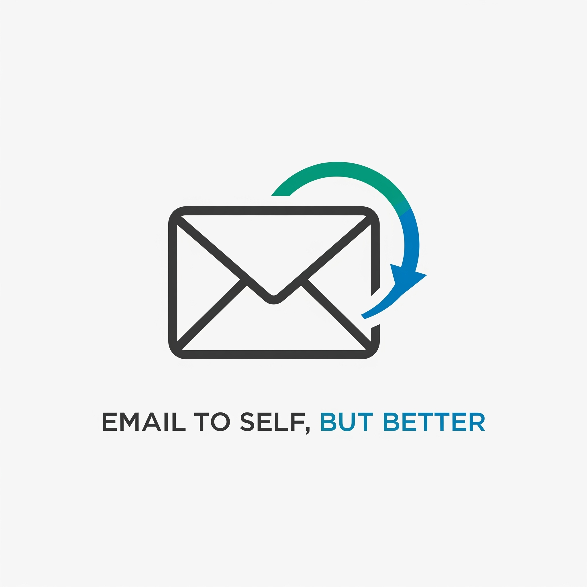

# Email to Self, But Better

  

## Testing an idea: What if your emailed notes were actually searchable?

---

### The Problem

You email yourself stuff all the time—articles, ideas, reminders, links. But finding that thing you sent yourself last week? Good luck digging through your inbox.

Email wasn't designed to be a personal filing system, but we all use it that way.

---

### The Idea

A dedicated email address that:
- Automatically files your self-emails away from your inbox
- Makes everything searchable
- Organizes content by type (articles, notes, tasks, etc.)

That's it. No complex features. Just a simple tool that makes your existing habit actually useful.

---

### This Doesn't Exist Yet

**This is just an idea I'm exploring.** I want to know if others face this same problem and would find this valuable.

If enough people are interested, I'll build it (likely on top of [Clarity Notes](https://clarity.hr/notes)

---

### How It Would Work

1. Send an email to a dedicated email address
2. Send anything there instead of to yourself
3. Access a simple web interface to search and browse everything you've saved

---

### Want to Know When This Launches?

If this sounds useful to you, leave your email below. I'll only contact you if/when I actually build this.

<iframe src="https://docs.google.com/forms/d/e/1FAIpQLSdQHc9FSGxYJUSfpz4F4mTUbMZejdpEet0MKKoOT_DbuqnhXA/viewform?usp=dialog" width="640" height="400" frameborder="0" marginheight="0" marginwidth="0">Loading…</iframe>

*No spam. Just a single email if this becomes real.*

---

### Questions or Thoughts?

Want to share feedback or ideas about this concept? Email me at [iklaric@clarity.hr]

---

*This is a concept validation page. No service currently exists.*
