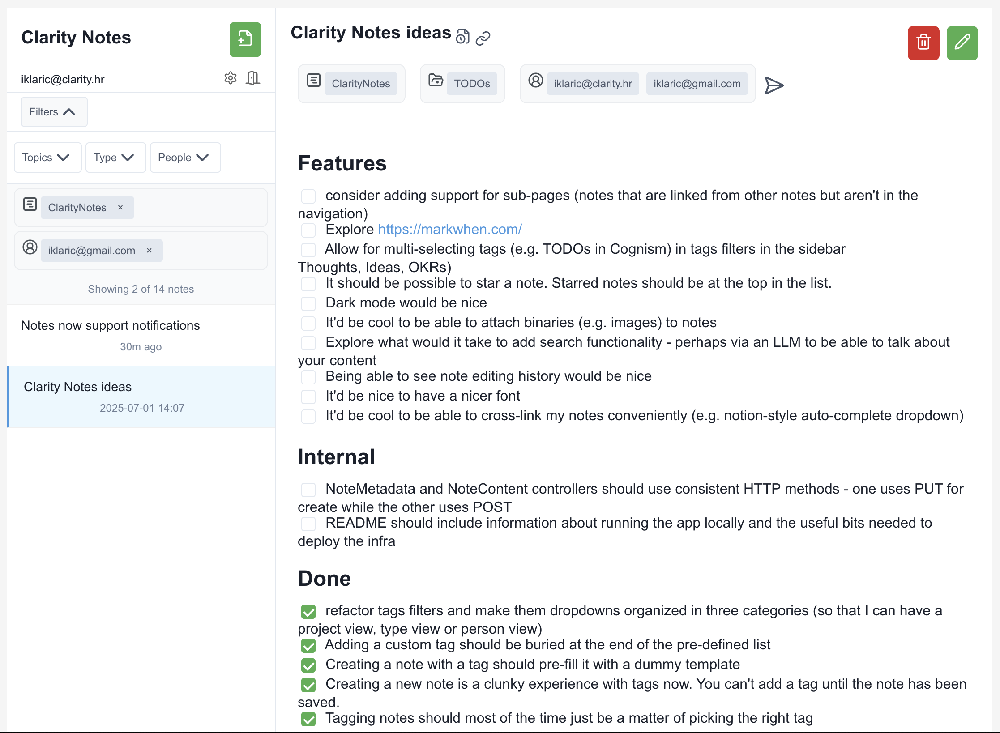

As workers in tech, most of our time is spent writing or reviewing code, notes, tech specs, prds, design documents, designs. People in leadership roles (EMs, PMs, TPMs, PgMs, TLs) tend to create and consume a lot of knowledge encoded in text: TODOs, random thoughts, notes on specific topics, etc. 

Over time, that's a lot of accumulated knowledge that's useful when doing retrospection (e.g. trying to recall everything you worked on with someone or recalling your initial thoughts on a project when it started). At the same time, this knowledge is frequently not recorded (who regularly takes and shares meeting notes?) or is hard to retrieve (it's hard to gauge whether a specific note is about a specific person).

Clarity Notes solves this by making this knowledge easier to record, retrieve, and summarize. For example:
  * when you start a meeting note, it'll pull meeting metadata (topic, description, invitees) from your calendar. Sharing the note via email with attendees is a click away.
  * if you forward or CC clarity notes on an email, it will get automatically imported into your notes together with metadata (email subject, content, recepients)
  * you can explicitly tag notes with types (1:1s, Thoughts, TODOs, Deployment plans, etc), projects, and people to make it easier to find, organize, and contextualize later.

Notes and their metadata are then fed to an LLM that make it easy to retrieve and summarize this knowledge. For example, you can easily answer questions such as
  * What's the summary of my interaction with Bruno over the past six months? What projects did we work on, what are the highlights?
  * What TODOs do I still have open across all my docs?
  * When did we originally decide to implement this feature that way?
or just plainly fetch (and share) useful frequently used information (e.g. code snippets, CSV/JSON dumps, etc) with others.

Notes is still very much a work in progress. You can see the current roadmap [here](https://notes.clarity.hr/public-notes/9a99169c-1dee-4869-b4be-3da46cac418d): 

<iframe src="https://notes.clarity.hr/public-notes/9a99169c-1dee-4869-b4be-3da46cac418d" width="100%" height="400"></iframe>
